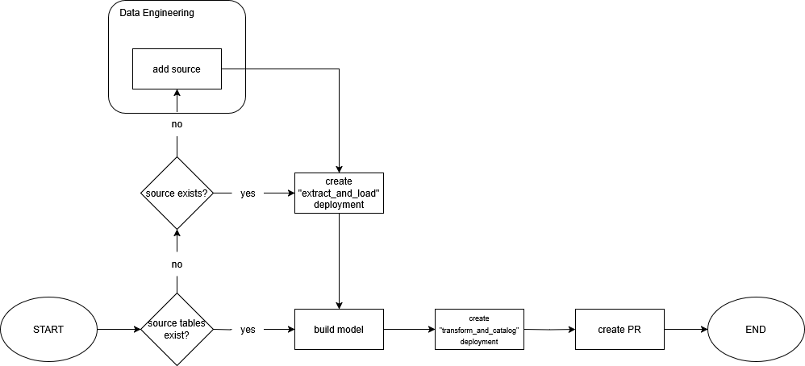

## The Modelling Workflow

There are two aspects of scaling and leveraging a data platform

* First, we need to setup a good data platform following best practices
* Second, we need to make sure analysts, data scientists and data engineers use it in the right way. This guide is going to be focused on this aspect.

Since data platforms are modular, the typical modelling workflow needs to account for each component of the data platform.

